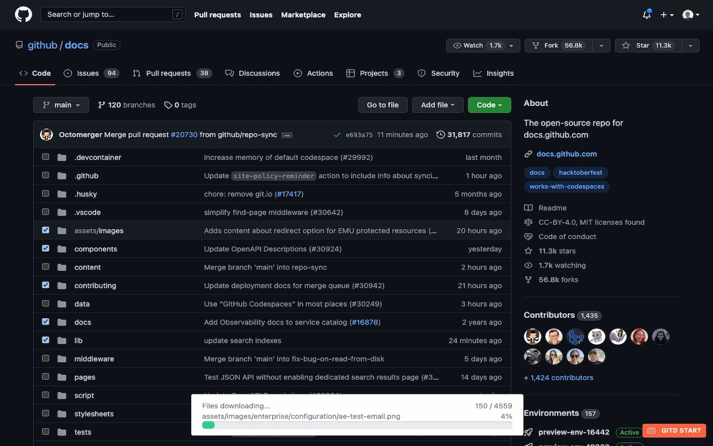

# Gitd Download Manager Browser Extension
It is a browser extension that allows you to download only the files/folders you want without having to download all of the public repository. Github.com, Bitbucket.org, Gitlab.com provides all of the public repos in git services to download selected files and folders as a zip files with a single click, without the need for any API key or token.

The "Gitd Start" button is ready for use on every screen you see.

> Note: Gitd Download Manager browser extension creates download lists using Gitdownloadmanager.com api service.



## Features
- Support only Github.com, Bitbucket.org, Gitlab.com public repositories page
- Not neeeded ApiKey/ApiToken
- Support single or multiple files download
- Download selected contents as a zip file with one click
- Support all branches
- Maximum Selection Limit: 5
- Maximum Download Files: 5000 

## Next Features
- No limitations for selection and downloading files count
- Support branch names with includes slash
- Support Bitbucket.org commitId url (Maybe)

## Compatibility
- Chrome (Manifestv3)
- Firefox (Manifestv2)
- Microsoft Edge (Manifestv3)

## Installation
### 1. Chrome Store/Firefox Add-Ons

Go to [Gitd Download Manager](https://chrome.google.com/webstore/detail/gitd-download-manager/cbnplpkljokdodpligcaolkmodfondhl) Chrome Store Page

Go to [Gitd Download Manager](https://addons.mozilla.org/en-US/firefox/addon/gitd-download-manager/) Firefox Add-Ons Page

Go to [Gitd Download Manager](https://microsoftedge.microsoft.com/addons/detail/-/-) Microsoft Edge Add-Ons Page

### 2. Production Build For Chrome Store / Firefox Add-on / Microsoft Edge 

- Go to the folder where the `README.md` file is located and run `./build.prod.sh <NEW_VERSION>` (./build.prod.sh 1.0.1) command after go to "build/prod/<NEW_VERSION>/" folder for zip files of all versions.
```
./build/prod/1.0.1/gitd-1.0.1-v2.dev.zip -> Firefox Extension - Development version - Manifest version 2
./build/prod/1.0.1/gitd-1.0.1-v2.zip -> Firefox Extension - Production Version - Manifest version 2
./build/prod/1.0.1/gitd-1.0.1-v3.dev.zip -> Chrome Store Extension - Development version - Manifest version 3
./build/prod/1.0.1/gitd-1.0.1-v3.zip -> Chrome Store Extension - Production Version - Manifest version 3
```

> Your operating system has to supports `pwd`, `cat`, `sed`, `zip`, `mkdir` Linux commands.

### 3.Local Development / Testing

- Run `./build.<env>.sh <NEW_VERSION>` (./build.dev.sh 1.0.1) command after go to "build/dev/<NEW_VERSION>/" folder for zip files of all versions.

```
./build/prod/1.0.1/gitd-1.0.1-v2.dev.zip -> Firefox Extension - Development version - Manifest version 2
./build/prod/1.0.1/gitd-1.0.1-v2.zip -> Firefox Extension - Production Version - Manifest version 2
./build/prod/1.0.1/gitd-1.0.1-v3.dev.zip -> Chrome Store Extension - Development version - Manifest version 3
./build/prod/1.0.1/gitd-1.0.1-v3.zip -> Chrome Store Extension - Production Version - Manifest version 3
```

- or install directly from browser extension page

1. Open Chrome and go to: chrome://extensions/ (same as Firefox)
2. Enable: "Developer mode"
3. Click: "Load unpacked extension"
4. Select: "extension" directory
5. Ready to use
6. Go to github.com, gitlab.com or bitbucket.org website

### Usage
- In the right corner of the browser, the "Gitd Start" button notifies you that the plugin is active.
- The plugin is automatically installed on Github.com and adds checkboxes, but on other websites you have to press the "Gitd Start" button.

### Find Open Source Projects: Public Repository
[Github.com](https://github.com/search/advanced) advanced search page.
[Gitlab.com](https://gitlab.com/explore/projects) advanced search page.
[Bitbucket.org](https://bitbucket.org/repo/all) simple search page.

## Licence
See LICENSE for more details.

# Thanks
[Alpinejs](https://alpinejs.dev) for DOM manipulation

[fflate](https://github.com/101arrowz/fflate) for generate zip packages

[Bootstrap Icons](https://icons.getbootstrap.com) for svg icons

[Photopea](https://www.photopea.com) for create logo, icon and favicon

[Liozon/Edge add-on badge.md](https://gist.github.com/Liozon/cf898c47628bfecd9896f79e6c9a8db8) for Microsoft Edge Add-On Badge

## Source
[Firefox Manifest Docs](https://developer.mozilla.org/en-US/docs/Mozilla/Add-ons/WebExtensions/manifest.json) * perfect docs

[Google Chrome Manifest Docs](https://developer.chrome.com/docs/extensions/mv3/manifest/) * not recomended **sorry**

[Microsoft Edge Manifest Docs](https://learn.microsoft.com/en-us/microsoft-edge/extensions-chromium/getting-started/manifest-format) * firefox alternate

## Changelog
v1.0.3
- update manifest description

v1.0.3
- compatible with github both page design

v1.0.2
- compatible with github new design